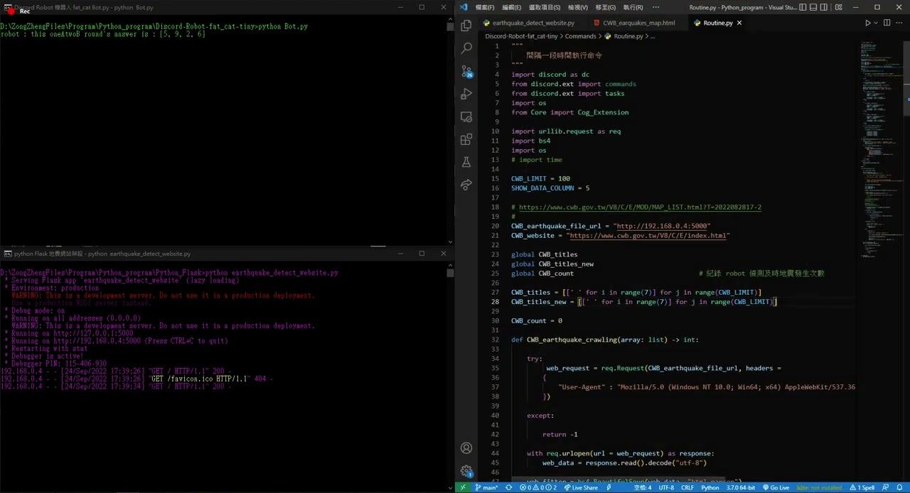
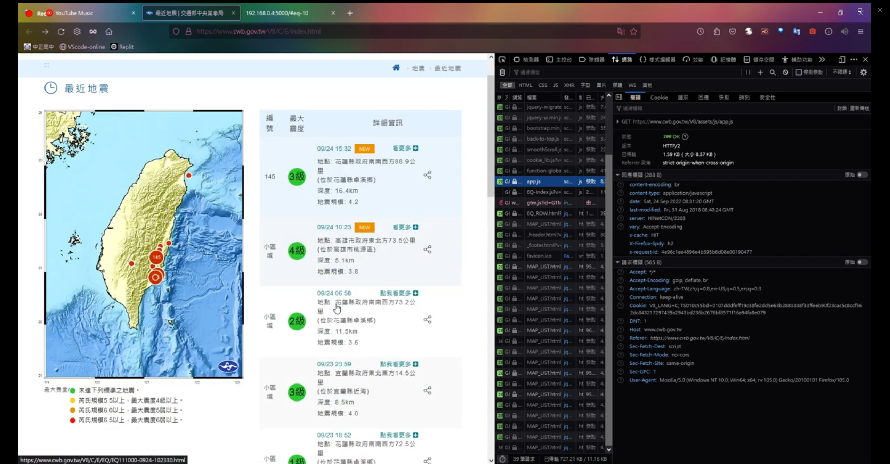
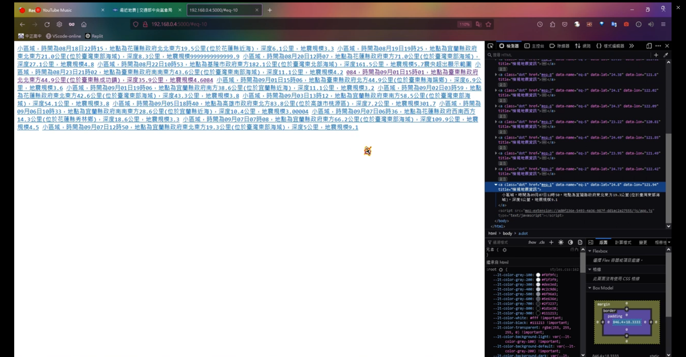
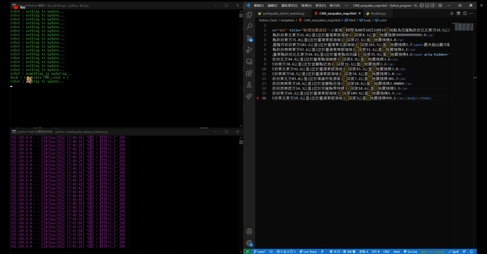
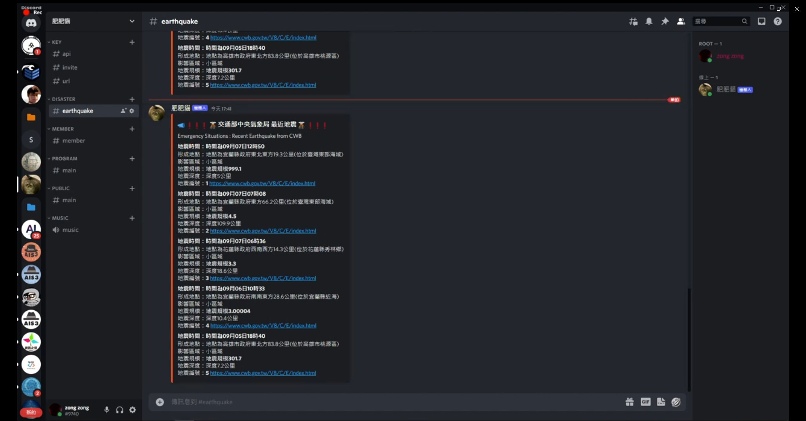

# 基於在 Discord 上的自動偵測地震及時回報系統 
# Discord Earthquake Detection System ChatBot

基於在 Discord 上的自動偵測地震及時回報系統。  
使用 Python 架設聊天機器人，配合爬蟲、disocrd API 調用實現。  

> 2024/05/05 啟用維護，參見[日誌](#日誌)。

- #### 範例圖片
<div align = "center"></div>
<div align = "center"></div>
<div align = "center"></div>
<div align = "center"></div>
<div align = "center"></div>

- #### 範例影片
    - [Discord Robot Earthquake Detection Robot 地震偵測功能 執行畫面](https://youtu.be/G_WQ1L2o_mE?si=HgtcAaNiqTIWhp1t)

- #### 技術文章
    - [基於 Discord Bot 的自動偵測地震及回報機器人](https://drive.google.com/file/d/1KoVMp36HbNwWH8vUUlcwltfjxMyS727S/view?usp=sharing)

---

## 目錄
- [目錄](#目錄)
- [開發環境](#開發環境)
- [如何執行](#如何執行)
- [版本差異](#版本差異)
- [日誌](#日誌)
- [貢獻](#貢獻)
- [著作權](#著作權)

---

## 開發環境

- Windows Home 10 64bit
- VScode
- Python `3.7.0`
- requests `2.27.1`
- discord `1.7.3`
- discord.py `1.7.3`
- beautifulsoup4 `4.11.1`

---

## 如何執行

> 預設 ***Windows Home 10 64bit*** 作業系統  

步驟 一：`Bot.py` & **line 17**：變數 **TOKEN** 記得更換為自己的機器人 token    

步驟 二：`database.json`：可替換成自己要傳的聊天室 ID，或是自己修改成想要的樣子  

步驟 二：執行機器人  

- 方法一：直接點兩下執行 `Bot.py`    
>
- 方法二：使用終端機

```bash
cd Python-discord-chatbot-earthquake-detection-system
```
```bash
python Bot.py
```
---

## 版本差異

| 版本 | 描述 |
| :--: | ---- |
| v1.0 | 現階段已完成。 |

---

## 日誌

| 時間 | 事件 |
| :--: | ---- |
| 2024/05/05 | 資料救援回復 **2022** 編輯紀錄，重新開始維護！ |

---

## 貢獻

獨立開發，抓取網站資料部分有參考[影片](https://www.youtube.com/watch?v=IMOUf4BYTG8)，蠻實用的工具。
不過若要使用就是要架設機器人，需要一台24/7的伺服器。

- [Python 網路爬蟲 Web Crawler 教學 - AJAX / XHR 網站技術分析實務 By 彭彭](https://www.youtube.com/watch?v=IMOUf4BYTG8)

---

## 著作權

此專案受到 [GPL-3.0](https://www.gnu.org/licenses/gpl-3.0.zh-tw.html) 保障。  
Copyright © 2022-2024 zong zong ( zongzong0408 )
